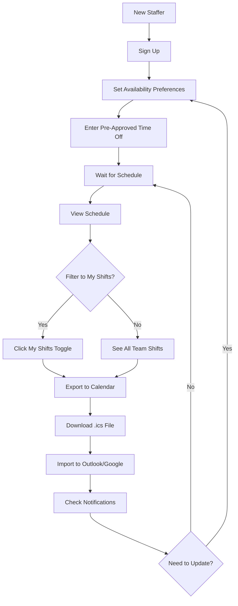
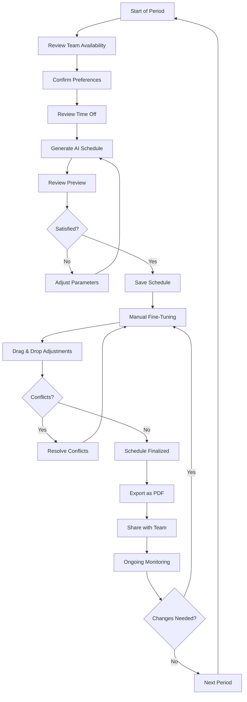
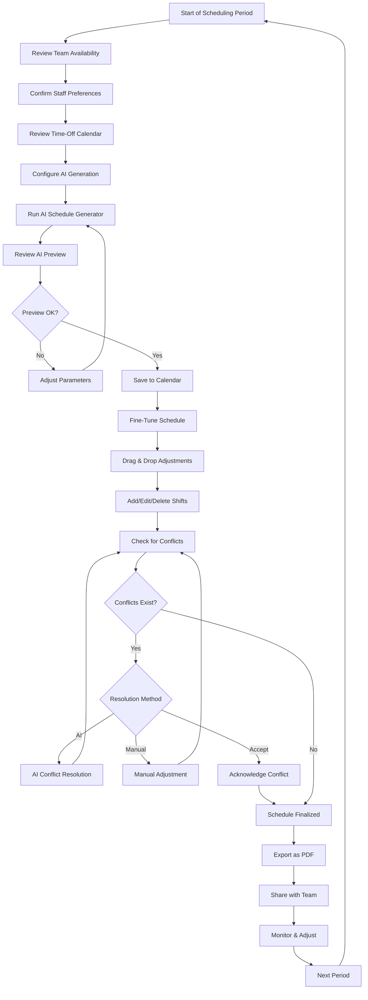
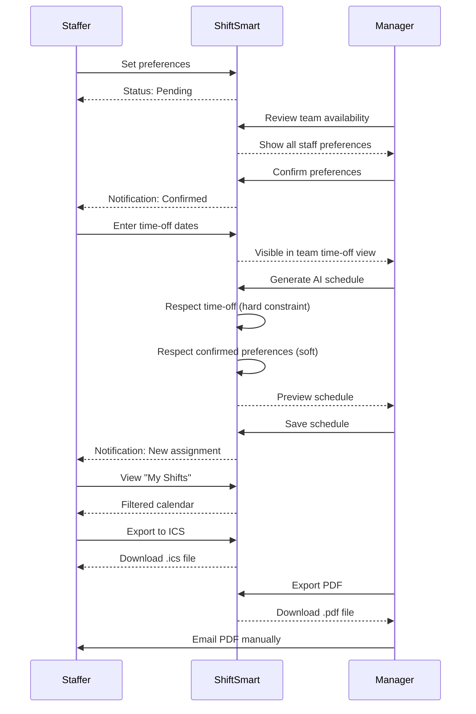
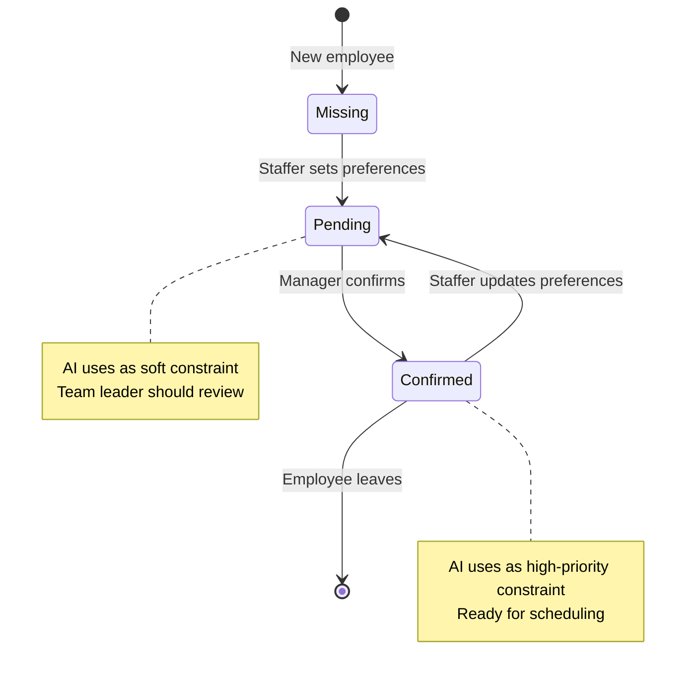
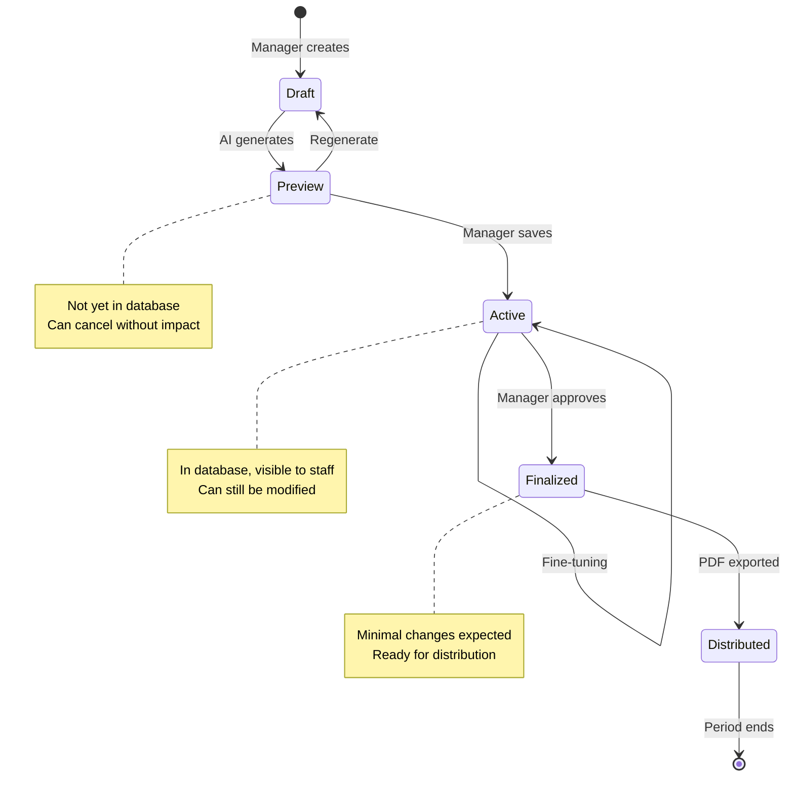

# ShiftSmart User Workflows

**Version:** 1.0.0  
**Date:** December 10, 2025  
**Purpose:** Definitive reference for ideal user journeys in ShiftSmart

---

## Overview

ShiftSmart serves two distinct user types with different workflows:

1. **Staffers** - Editorial team members who work shifts
2. **Team Leaders/Managers** - Administrators who create and manage schedules

This document describes the complete end-to-end workflow for each user type.

---

## User Type 1: Staffer Workflow

### Profile

**Who they are:**

- Editorial staff in Breaking News team
- Based in Milan or Rome bureau
- Roles: Correspondent, Senior Correspondent, or Editor
- System role: `staff`

**What they need to do:**

- Communicate availability and time-off
- View their assigned schedule
- Sync schedule with personal calendar
- Stay informed of changes

---

### Staffer Complete Workflow

#### Phase 1: Initial Setup (One-time)

**Step 1.1: Account Creation**

- Navigate to `/signup`
- Provide: email, password, full name, phone
- Select bureau (Milan or Rome)
- Select editorial role (Correspondent/Senior/Editor)
- System automatically assigns them to Breaking News team

**Step 1.2: Set Shift Preferences**

- Navigate to `/dashboard/my-availability`
- Select preferred days of week (e.g., Monday-Friday)
- Select preferred shift types (Morning/Afternoon/Evening/Night)
- Set maximum shifts per week (3-7)
- Add notes for special constraints (e.g., "Unavailable Tuesdays for childcare")
- Click "Save Preferences"
- Status shows "Pending Approval" until team leader confirms

**UI Location:** `/dashboard/my-availability`  
**API:** `PUT /api/employees/{id}/preferences`

---

#### Phase 2: Time-Off Management (Ongoing)

**Step 2.1: Enter Pre-Approved Time Off**

- Navigate to `/dashboard/my-time-off`
- Click "Add Time Off Entry"
- Enter start and end dates
- Select type: Vacation, Personal, Sick, or Other
- Add optional notes
- Submit

**Important:** Only enter dates already approved through bureau's leave system. This is informational input, not a request.

**UI Location:** `/dashboard/my-time-off`  
**API:** `POST /api/time-off`

**Step 2.2: View Time-Off Entries**

- See list of all time-off entries
- Edit or delete future entries if plans change
- Past entries shown as read-only

---

#### Phase 3: Schedule Viewing (Weekly)

**Step 3.1: View All Shifts**

- Navigate to `/dashboard/schedule`
- Default view shows entire team schedule
- Use date picker to navigate weeks/months
- Can see who's working when

**Step 3.2: Filter to My Shifts**

- Click "My Shifts" toggle button
- Calendar now shows only shifts assigned to you
- Preference persists across sessions
- Click "All Shifts" to see full team view again

**UI Location:** `/dashboard/schedule`  
**Feature:** Toggle filter (NEW)

**Step 3.3: Download to Personal Calendar**

- Click "Export Calendar" button
- Downloads `.ics` file for current month
- Open file to import into:
  - Microsoft Outlook
  - Google Calendar
  - Apple Calendar
  - Any iCalendar-compatible app
- Shifts appear with correct times, locations, and details

**UI Location:** `/dashboard/schedule` → "Export Calendar" button  
**API:** `GET /api/shifts/export/ics` (NEW)

---

#### Phase 4: Stay Informed (Continuous)

**Step 4.1: Check Notifications**

- Bell icon in header shows unread count
- Click to see recent notifications:
  - "New Shift Assigned" - when scheduled for a shift
  - "Schedule Change" - when a shift is modified/cancelled
  - "Preferences Confirmed" - when team leader approves preferences

**Step 4.2: Mark as Read**

- Click individual notification to view
- Click "Mark all read" to clear all
- Notifications auto-refresh every 60 seconds

**UI Location:** Bell icon in header (NEW)  
**API:** `GET /api/notifications` (NEW)

**Future:** Email notifications when implemented

---

### Staffer Workflow Summary



---

## User Type 2: Team Leader/Manager Workflow

### Profile

**Who they are:**

- Team leaders, schedulers, or administrators
- Responsible for creating and managing schedules
- System role: `admin`, `manager`, or `is_team_leader: true`

**What they need to do:**

- Ensure adequate staffing coverage
- Balance workload fairly across team
- Respect staff preferences and time-off
- Distribute schedules to team
- Handle conflicts and exceptions

---

### Manager Complete Workflow

#### Phase 1: Pre-Schedule Preparation (Weekly/Monthly)

**Step 1.1: Review Team Availability**

- Navigate to `/dashboard/team`
- Click "Availability" tab
- View table showing all staff members with:
  - Preferred days of week
  - Preferred shift types
  - Maximum shifts per week
  - Confirmation status (Confirmed/Pending/Missing)
  - Any special notes

**Step 1.2: Confirm Staff Preferences**

Option A - Individual confirmation:

- Click checkmark button next to staff member
- Preferences marked as "Confirmed"
- Staff receives notification (when email enabled)

Option B - Batch confirmation:

- Click "Confirm All Pending" button
- Dialog shows count of pending preferences
- Confirm to approve all at once
- Defaults applied to any missing preferences

**UI Location:** `/dashboard/team` → Availability tab  
**API:** `POST /api/employees/{id}/preferences/confirm` or `POST /api/team/confirm-all`

**Step 1.3: Review Team Time-Off**

- Click "Time Off" tab on same page
- See table of all upcoming time-off entries:
  - Employee name and bureau
  - Date range
  - Type (vacation/personal/sick)
  - Notes
- Stats cards show:
  - Total requests (next 30 days)
  - Number of employees taking time off
  - Breakdown by type

**Note:** In current model, this is informational only (pre-approved). No approval action needed.

**UI Location:** `/dashboard/team` → Time Off tab  
**API:** `GET /api/team/time-off`

---

#### Phase 2: Schedule Generation (Beginning of Period)

**Step 2.1: Select Schedule Period**

- Navigate to `/dashboard/schedule`
- Click "Generate Schedule" button
- Choose period type:
  - Week (7 days)
  - Month (30 days)
  - Quarter (90 days)
- Select date range with pickers
- Select bureau: Milan, Rome, or Both
- Choose whether to preserve existing shifts

**Step 2.2: Generate AI Schedule**

- Click "Generate" to invoke AI
- AI analyzes:
  - Confirmed staff preferences
  - Pre-approved time-off dates (hard constraint)
  - Pending preferences (soft constraint)
  - Recent shift history (for fairness)
  - Bureau requirements (min senior per shift, etc.)
- Shows progress indicator
- Preview generates in 5-15 seconds

**Step 2.3: Review AI Preview**

- Preview shows all proposed shifts in calendar view
- Scroll through to review coverage
- Check metrics:
  - Total shifts generated
  - Preference satisfaction rate
  - Any hard constraint violations
- If conflicts exist, warning dialog appears with details

**Step 2.4: Save or Regenerate**

- If satisfied: Click "Save Schedule to Calendar"
- If not satisfied: Click "Cancel" and regenerate with different parameters
- Option to force save despite conflicts (logs for review)

**UI Location:** `/dashboard/schedule` → "Generate Schedule" dialog  
**API:** `POST /api/ai/generate-schedule` → `POST /api/ai/save-schedule`

---

#### Phase 3: Manual Fine-Tuning (After AI Generation)

**Step 3.1: Make Adjustments**

- Use drag-and-drop to move shifts:
  - Drag shift card from one date to another
  - Drag from one employee to another
  - Pre-save validation warns of conflicts
- Manually create shifts:
  - Click "Add Shift" button
  - Select date, time, employee
  - Save individual shift
- Edit existing shifts:
  - Click shift card
  - Modify time or assignment
  - Save changes

**Step 3.2: Handle Conflicts**

- Real-time conflict detection during drag
- Warning dialog shows:
  - Conflict type (Double Booking, Rest Period, etc.)
  - Severity (High/Medium/Low)
  - Affected employee
  - Option to proceed anyway or cancel
- Navigate to `/dashboard/conflicts` to see all issues
- Use AI conflict resolution for suggestions

**UI Location:** `/dashboard/schedule` (drag-and-drop)  
**API:** `PATCH /api/shifts/{id}` with conflict validation

---

#### Phase 4: Schedule Distribution (After Finalization)

**Step 4.1: Export Schedule as PDF**

- Navigate to `/dashboard/schedule`
- Click "Export PDF" button
- Select date range (defaults to current month)
- Select bureau filter if needed
- PDF generates and downloads
- Professional table format showing:
  - Date, Time, Employee, Bureau, Role
  - Header with date range and bureau
  - Footer with generation timestamp

**Step 4.2: Share with Team**

Current method:

- Email PDF as attachment
- Upload to shared drive
- Print for posting in bureau office

Future (when email integration ready):

- Click "Share Schedule" button
- Select recipients or "All team members"
- System emails PDF to everyone
- Notification sent confirming distribution

**UI Location:** `/dashboard/schedule` → "Export PDF" button (NEW)  
**API:** `GET /api/shifts/export/pdf` (NEW)

---

#### Phase 5: Ongoing Monitoring

**Step 5.1: Dashboard Overview**

- Navigate to `/dashboard`
- View statistics:
  - Total active employees
  - Upcoming shifts (next 7 days)
  - Unresolved conflicts
  - Coverage trends
- See list of next shifts per bureau

**Step 5.2: Handle Schedule Changes**

- Staff calls in sick → reassign shift via drag-drop
- Coverage gap identified → create new shift
- Conflict detected → resolve or acknowledge
- Preferences updated by staff → review and confirm

**UI Location:** `/dashboard` (main)  
**Ongoing APIs:** All shift/conflict management endpoints

---

### Manager Workflow Summary



---

## Workflow Comparison Matrix

| Activity          | Staffer Actions                    | Manager Actions                      |
| ----------------- | ---------------------------------- | ------------------------------------ |
| **Setup**         | Set preferences once               | Review all staff preferences         |
| **Time Off**      | Enter pre-approved dates           | View team time-off (informational)   |
| **Scheduling**    | Wait for assignment                | Generate + fine-tune schedule        |
| **Viewing**       | View own shifts via filter         | View all shifts, all staff           |
| **Exporting**     | Download ICS for personal calendar | Export PDF for team distribution     |
| **Changes**       | Submit updated preferences         | Approve preferences, reassign shifts |
| **Notifications** | Receive alerts for assignments     | Receive alerts for conflicts         |

---

## Key Workflow Differences

### Access Control

| Feature                | Staffer             | Team Leader         |
| ---------------------- | ------------------- | ------------------- |
| View team availability | ❌ No               | ✅ Yes              |
| Confirm preferences    | ❌ No               | ✅ Yes              |
| Generate AI schedule   | ❌ No               | ✅ Yes              |
| Export PDF             | ❌ No               | ✅ Yes              |
| Export ICS calendar    | ✅ Yes (own shifts) | ✅ Yes (all shifts) |
| Create/edit shifts     | ❌ No               | ✅ Yes              |
| Resolve conflicts      | ❌ No               | ✅ Yes              |

### Information Visibility

| Data                | Staffer Sees              | Manager Sees       |
| ------------------- | ------------------------- | ------------------ |
| Own preferences     | ✅ Full details           | ✅ Full details    |
| Others' preferences | ❌ Hidden                 | ✅ Full team view  |
| Own time-off        | ✅ All entries            | ✅ All entries     |
| Others' time-off    | ❌ Hidden                 | ✅ Full team view  |
| Own shifts          | ✅ Via "My Shifts" filter | ✅ Plus all others |
| Schedule conflicts  | ⚠️ If affects them        | ✅ All conflicts   |

---

## Detailed User Stories

### Staffer User Stories

**US-S1: As a staffer, I want to set my shift preferences so the scheduler knows my availability**

**Steps:**

1. Login to ShiftSmart
2. Navigate to "My Availability" from sidebar
3. Check boxes for preferred days (e.g., Mon, Tue, Wed, Thu, Fri)
4. Check boxes for preferred shifts (e.g., Morning, Afternoon)
5. Select max shifts per week from dropdown (e.g., 5)
6. Enter any additional notes in text area
7. Click "Save Preferences"
8. See confirmation message and "Pending Approval" badge
9. Wait for team leader to review and confirm
10. Receive notification when confirmed

**Acceptance Criteria:**

- Preferences saved to database
- Status shows "Pending" until confirmed
- AI scheduler uses preferences when generating schedule
- Can update preferences anytime (resets to pending)

---

**US-S2: As a staffer, I want to enter my vacation dates so I'm not scheduled when I'm away**

**Steps:**

1. Navigate to "My Time Off"
2. Click "Add Time Off Entry"
3. Select start date from date picker
4. Select end date from date picker
5. Choose type (Vacation/Personal/Sick/Other)
6. Add optional notes
7. Click "Add Entry"
8. See entry appear in list
9. When AI generates schedule, these dates are blocked (hard constraint)

**Acceptance Criteria:**

- Cannot enter overlapping time-off entries
- End date must be >= start date
- AI scheduler respects as hard constraint (never schedules on these dates)
- Can edit future entries, cannot edit past entries

---

**US-S3: As a staffer, I want to view only my assigned shifts so I know when I'm working**

**Steps:**

1. Navigate to "Schedule Management"
2. See full team schedule by default
3. Click "My Shifts" toggle button in toolbar
4. Calendar updates to show only shifts assigned to me
5. Can still navigate between Today/Week/Month/Quarter views
6. Preference remembered when I return later
7. Click "All Shifts" to see full team view

**Acceptance Criteria:**

- Filter works across all calendar views
- Only shows shifts where I'm assigned
- Unassigned shifts hidden
- Preference persists in localStorage
- No API calls needed (client-side filter)

---

**US-S4: As a staffer, I want to download my schedule to Outlook so it's in my personal calendar**

**Steps:**

1. Navigate to "Schedule Management"
2. Optionally filter to "My Shifts"
3. Click "Export Calendar" button
4. Browser downloads `shiftsmart-schedule-YYYY-MM-DD-to-YYYY-MM-DD.ics` file
5. Open the `.ics` file
6. Outlook/Google Calendar launches with import dialog
7. Confirm import
8. All shifts appear in personal calendar with:
   - Correct date and time
   - Title: "Shift - Milan" (or Rome)
   - Location: Bureau name
   - Description: Editorial role

**Acceptance Criteria:**

- ICS file exports only user's assigned shifts
- Date range covers current month
- Imports successfully into Outlook, Google Calendar, Apple Calendar
- Times are correct (timezone handled properly)
- Can re-export anytime to get updated schedule

---

### Manager User Stories

**US-M1: As a team leader, I want to review all staff availability so I know constraints before scheduling**

**Steps:**

1. Login to ShiftSmart
2. Navigate to "Team Management"
3. See "Availability" tab (default)
4. View table with all staff showing:
   - Name, bureau, title
   - Preferred days
   - Preferred shifts
   - Max per week
   - Status (Confirmed/Pending/Missing)
5. Use filters to focus on:
   - Specific bureau (Milan/Rome)
   - Specific status
   - Search by name
6. See stats cards at top:
   - Total employees
   - How many confirmed
   - How many pending
   - How many missing preferences

**Acceptance Criteria:**

- See all staff in Breaking News team
- Can filter by bureau, status, or search
- Clear visual status indicators
- Pagination if >25 staff members

---

**US-M2: As a team leader, I want to batch confirm all staff preferences so I don't have to click each individually**

**Steps:**

1. On Team Management → Availability tab
2. Review any pending or missing preferences
3. Click "Confirm All Pending" button
4. See confirmation dialog: "This will confirm preferences for X employees..."
5. Click "Confirm All"
6. System applies defaults to missing preferences
7. All pending preferences marked as confirmed
8. Staff receive notifications (when email enabled)
9. See success message with count

**Acceptance Criteria:**

- Single action confirms multiple staff
- Missing preferences get safe defaults
- Confirmation timestamp and confirmer tracked
- Each staff can see who confirmed their preferences

---

**US-M3: As a team leader, I want to generate an AI schedule so I don't manually assign each shift**

**Steps:**

1. Navigate to "Schedule Management"
2. Click "Generate Schedule" button
3. In dialog, configure:
   - Period type: Week/Month/Quarter
   - Start and end dates
   - Bureau: Milan, Rome, or Both
   - Preserve existing shifts: Yes/No
4. Click "Generate"
5. Wait 5-15 seconds for AI processing
6. Review preview showing:
   - All proposed shifts in calendar view
   - Number of shifts generated
   - Preference satisfaction metrics
   - Any constraint violations
7. See warning if conflicts detected with details
8. Choose:
   - "Save Schedule to Calendar" if acceptable
   - "Cancel" to try different parameters
   - "Force Save" if willing to accept conflicts (logged for review)

**Acceptance Criteria:**

- AI respects all confirmed preferences (high priority)
- AI blocks time-off dates (hard constraint)
- AI considers pending preferences (lower priority)
- AI ensures coverage requirements met
- Generates fair distribution across team
- Shows clear preview before saving
- Warns of any conflicts before committing

---

**US-M4: As a team leader, I want to fine-tune the AI schedule so I can handle exceptions**

**Steps:**

1. After AI generation (or working with existing schedule)
2. Navigate to desired date in calendar
3. Make adjustments:

   **Drag to reschedule:**
   - Drag shift card to new date
   - System validates for conflicts
   - Warning shows if conflict detected
   - Choose to proceed or cancel

   **Manually create shift:**
   - Click "Add Shift" button
   - Select date, start time, end time
   - Optionally assign employee
   - Save

   **Edit shift:**
   - Click shift card to open details
   - Modify time or assignment
   - Save changes

   **Delete shift:**
   - Click trash icon on shift card
   - Confirm deletion

4. After each change:
   - Shift updates immediately in UI
   - Conflict detection runs
   - Affected employees (will) receive notification

**Acceptance Criteria:**

- Drag-and-drop works across all views
- Conflict validation before save
- Can force changes despite warnings
- Changes reflected immediately
- Audit trail maintained

---

**US-M5: As a team leader, I want to resolve scheduling conflicts so the schedule is clean**

**Steps:**

1. Notice conflict indicator on shift (red border)
2. OR navigate to `/dashboard/conflicts`
3. See list of all conflicts:
   - Type (Double Booking, Rest Period, Skill Gap, etc.)
   - Severity (High/Medium/Low)
   - Description
   - Affected employee and date
   - Related shifts
4. For each conflict, choose:

   **Option A - Use AI resolution:**
   - Click "Resolve with AI" button
   - AI suggests specific fix
   - Review suggestion
   - Accept to apply automatically

   **Option B - Manual resolution:**
   - Go to schedule page
   - Adjust shifts manually
   - Conflict auto-resolves when fixed

   **Option C - Acknowledge:**
   - Click "Acknowledge" if intentional
   - Marks as reviewed but keeps conflict
   - Requires explanation note

**Acceptance Criteria:**

- All conflicts visible in one place
- Can filter by severity or type
- AI suggestions are actionable
- Manual fixes auto-resolve conflicts
- Acknowledged conflicts tracked separately

---

**US-M6: As a team leader, I want to export the finalized schedule as PDF so I can share it with the team**

**Steps:**

1. Schedule is finalized (no unresolved conflicts, or acceptable acknowledged conflicts)
2. Navigate to "Schedule Management"
3. Click "Export PDF" button
4. PDF generates showing:
   - Date range in header
   - Bureau filter if applied
   - Table with all shifts: Date, Time, Employee, Bureau, Role
   - Footer with generation timestamp
5. PDF downloads automatically
6. Share PDF via:
   - Email attachment to team members
   - Upload to shared drive
   - Print and post in bureau office

**Acceptance Criteria:**

- Professional, printable format
- Includes all relevant shift information
- Clear headers and structure
- Correct data for selected date range
- File named with date range for easy organization

---

### Manager Workflow Summary



---

## Workflow Integration Points

### How Staffer and Manager Workflows Intersect

| Staffer Action      | Triggers | Manager Action                      |
| ------------------- | -------- | ----------------------------------- |
| Submit preferences  | →        | Review in Team Availability         |
| Enter time-off      | →        | View in Team Time-Off tab           |
| Preferences updated | →        | Re-confirm needed (status: Pending) |
| -                   | ←        | AI generates schedule               |
| -                   | ←        | Manager fine-tunes via drag-drop    |
| Assigned to shift   | ←        | Notification sent (future)          |
| View "My Shifts"    | ←        | No manager action needed            |
| Download ICS        | ←        | No manager action needed            |
| -                   | →        | Manager exports PDF to share        |

### Communication Flow



---

## Workflow State Diagram

### Preference Status Lifecycle



### Schedule Lifecycle



---

## Success Metrics Per User Type

### Staffer Success

**Time to complete workflow:**

- Initial setup: < 5 minutes
- Enter time-off: < 2 minutes
- View and export schedule: < 1 minute

**Experience metrics:**

- Can see own schedule in < 3 clicks
- Calendar export works on first try
- Receives timely notifications (when email enabled)

### Manager Success

**Time to complete workflow:**

- Review team availability: < 10 minutes (for 15 staff)
- Generate AI schedule: < 30 seconds
- Fine-tune schedule: < 15 minutes (monthly schedule)
- Export and share: < 2 minutes

**Experience metrics:**

- AI schedule requires < 5 manual adjustments
- Preference satisfaction > 80%
- Zero unresolved conflicts at distribution
- PDF professional and print-ready

---

## Navigation Paths

### Staffer Primary Navigation

```
/dashboard (landing)
  ├── /dashboard/my-availability ⭐ (Set preferences)
  ├── /dashboard/my-time-off ⭐ (Enter time-off)
  ├── /dashboard/schedule ⭐ (View shifts, export ICS)
  ├── /dashboard/settings (Profile settings)
  └── Notification bell (Check alerts)
```

### Manager Primary Navigation

```
/dashboard (landing)
  ├── /dashboard/team ⭐⭐ (Review & confirm preferences, view time-off)
  ├── /dashboard/schedule ⭐⭐ (Generate AI, drag-drop, export PDF)
  ├── /dashboard/conflicts ⭐ (Resolve issues)
  ├── /dashboard/employees (Manage staff)
  └── Notification bell (Check alerts)
```

⭐ = Daily use  
⭐⭐ = Primary workflow

---

## Workflow Optimization Tips

### For Staffers

1. **Set preferences once, update only when needed** - Team leader can see change history
2. **Enter time-off as soon as approved** - AI needs advance notice for scheduling
3. **Use "My Shifts" filter** - Faster than scanning full calendar
4. **Export ICS at start of month** - Keeps personal calendar synced
5. **Check notifications daily** - Stay informed of changes

### For Managers

1. **Confirm all preferences before generating** - Improves AI quality
2. **Review time-off tab first** - Identify coverage gaps early
3. **Start with AI generation** - Faster than manual scheduling
4. **Use drag-drop for exceptions only** - Let AI handle bulk work
5. **Export PDF after finalization** - Avoid re-exports from changes
6. **Resolve conflicts immediately** - Prevents cascade issues

---

## Frequently Asked Questions

### Staffer FAQ

**Q: Why does my preference status say "Pending"?**  
A: A team leader needs to review and confirm your preferences. Once confirmed, they'll be prioritized in AI scheduling.

**Q: Can I change my preferences after they're confirmed?**  
A: Yes, but they'll reset to "Pending" and need re-confirmation.

**Q: What if I'm scheduled during my time-off?**  
A: This shouldn't happen - time-off is a hard constraint. Contact your team leader immediately.

**Q: How often should I export to my calendar?**  
A: At the start of each month, or whenever the schedule changes.

### Manager FAQ

**Q: Should I confirm preferences before or after generating the schedule?**  
A: Before. Confirmed preferences get higher priority in AI scheduling.

**Q: What's the difference between "pending" and "missing" preferences?**  
A: Pending = staff submitted, awaiting review. Missing = staff hasn't submitted anything yet.

**Q: Can I override the AI schedule?**  
A: Yes, use drag-and-drop or manual shift creation. AI is a starting point, not a constraint.

**Q: What if I need to schedule someone during their preferred off-days?**  
A: You can, but it will flag as a "Preference Violation" soft warning. You can proceed if needed.

**Q: How do I share the PDF with my team?**  
A: Currently, download PDF and email manually. Future: direct email from app.

---

## Related Documentation

- **Technical:** `docs/USER_WORKFLOW_ANALYSIS.md` - Feature gap analysis
- **Implementation:** `WORKFLOW_IMPLEMENTATION_SUMMARY.md` - Code changes
- **API:** `API_REFERENCE.md` - Endpoint contracts
- **Database:** `DATABASE_SCHEMA.md` - Data structure
- **Testing:** `tests/README.md` - How to test workflows

---

**Document Status:** Complete  
**Last Updated:** December 10, 2025  
**Maintained by:** Reuters Breaking News Engineering Team
